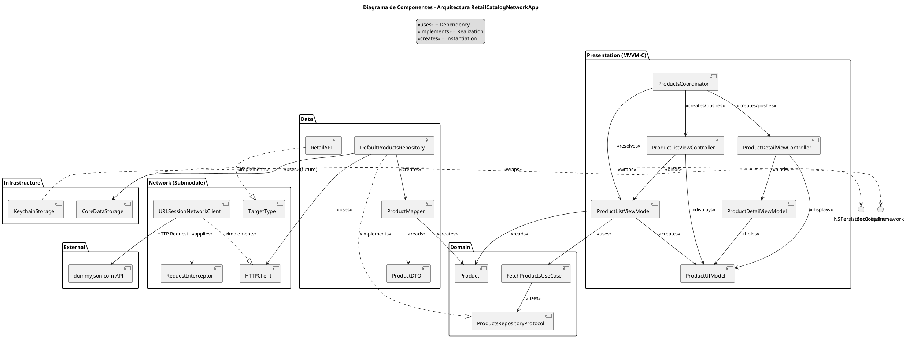

# Diagrama de Componentes - Arquitectura RetailCatalogNetworkApp

```plantuml
@startuml
title Diagrama de Componentes - Arquitectura RetailCatalogNetworkApp

package "Presentation (MVVM-C)" {
  [ProductsCoordinator] as coordinator
  [ProductListViewController] as listView
  [ProductDetailViewController] as detailView
  [ProductListViewModel] as listVM
  [ProductDetailViewModel] as detailVM
  [ProductUIModel] as uiModel
}

package "Domain" {
  [Product] as entity
  [ProductsRepositoryProtocol] as repoProtocol
  [FetchProductsUseCase] as usecase
}

package "Data" {
  [DefaultProductsRepository] as repoImpl
  [ProductDTO] as dto
  [ProductMapper] as mapper
  [RetailAPI] as api
}

package "Infrastructure" {
  [CoreDataStorage] as coredata
  [KeychainStorage] as keychain
}

package "Network (Submodule)" {
  [HTTPClient] as httpProtocol
  [TargetType] as targetType
  [URLSessionNetworkClient] as httpImpl
  [RequestInterceptor] as interceptor
}

package "External" {
  [dummyjson.com API] as externalAPI
}

' Domain dependencies
usecase --> repoProtocol : <<uses>>
repoImpl ..|> repoProtocol : <<implements>>
repoImpl --> httpProtocol : <<uses>>
repoImpl --> coredata : <<uses>> (futuro)
repoImpl --> mapper : <<creates>>

' Data mappings
mapper --> dto : <<reads>>
mapper --> entity : <<creates>>

' API definition
api ..|> targetType : <<implements>>

' Network implementation
httpImpl ..|> httpProtocol : <<implements>>
httpImpl --> interceptor : <<applies>>
httpImpl --> externalAPI : HTTP Request

' Presentation dependencies
coordinator --> listView : <<creates/pushes>>
coordinator --> detailView : <<creates/pushes>>
coordinator --> listVM : <<resolves>>
listView --> listVM : <<binds>>
listView --> uiModel : <<displays>>
detailView --> detailVM : <<binds>>
detailView --> uiModel : <<displays>>
listVM --> usecase : <<uses>>
listVM --> entity : <<reads>>
listVM --> uiModel : <<creates>>
detailVM --> uiModel : <<holds>>

' Infrastructure
coredata .> NSPersistentContainer : <<wraps>>
keychain .> Security.framework : <<wraps>>

legend top
  <<uses>> = Dependency
  <<implements>> = Realization
  <<creates>> = Instantiation
endlegend

@enduml
```
