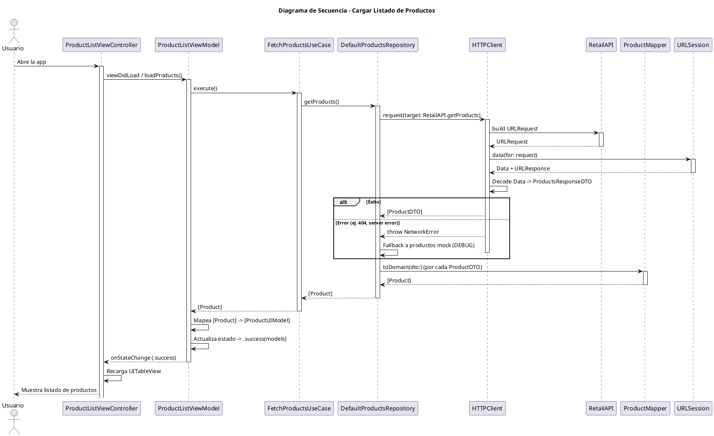

# Diagrama de Secuencia - Cargar Listado de Productos

```plantuml
@startuml
title Diagrama de Secuencia - Cargar Listado de Productos

actor Usuario as user
participant ProductListViewController as view
participant ProductListViewModel as vm
participant FetchProductsUseCase as usecase
participant DefaultProductsRepository as repo
participant HTTPClient as client
participant RetailAPI as api
participant ProductMapper as mapper

user -> view: Abre la app
activate view

view -> vm: viewDidLoad / loadProducts()
activate vm

vm -> usecase: execute()
activate usecase

usecase -> repo: getProducts()
activate repo

repo -> client: request(target: RetailAPI.getProducts)
activate client

client -> api: build URLRequest
activate api
api --> client: URLRequest
deactivate api

client -> URLSession: data(for: request)
activate URLSession
URLSession --> client: Data + URLResponse
deactivate URLSession

client -> client: Decode Data -> ProductsResponseDTO

alt Éxito
    client --> repo: [ProductDTO]
else Error (ej. 404, server error)
    client --> repo: throw NetworkError
    repo -> repo: Fallback a productos mock (DEBUG)
    deactivate client
end

deactivate client

repo -> mapper: toDomain(dto:) (por cada ProductDTO)
activate mapper
mapper --> repo: [Product]
deactivate mapper

repo --> usecase: [Product]
deactivate repo

usecase --> vm: [Product]
deactivate usecase

vm -> vm: Mapea [Product] -> [ProductUIModel]
vm -> vm: Actualiza estado -> .success(models)

vm --> view: onStateChange (.success)
deactivate vm

view -> view: Recarga UITableView
view --> user: Muestra listado de productos

@enduml
```
